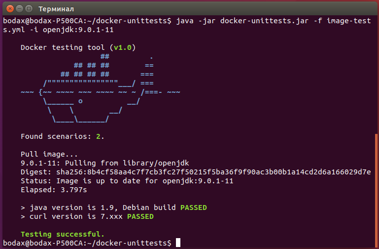
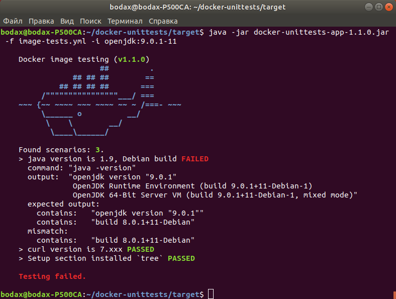

  
[](https://mvnrepository.com/artifact/com.github.dgroup/docker-unittests)
[](http://www.javadoc.io/doc/com.github.dgroup/docker-unittests)
[](./license.txt) 
[](https://github.com/dgroup/docker-unittests/graphs/commit-activity)

[](https://travis-ci.org/dgroup/docker-unittests)
[](http://www.0pdd.com/p?name=dgroup/docker-unittests)
[](https://requires.io/github/dgroup/docker-unittests/requirements/?branch=master)
[](https://snyk.io/org/dgroup/project/58b731a9-6b07-4ccf-9044-ad305ad243e6/?tab=dependencies&vulns=vulnerable)

<!--- [](https://github.com/dgroup/docker-unittests/milestone/2) -->
<a href="https://www.yegor256.com/2017/10/24/award-2018.html">
  
</a>

[](http://www.rultor.com/p/dgroup/docker-unittests)
[](http://www.elegantobjects.org/#principles)
[](https://www.jetbrains.com/idea/)

<!--- [](http://i.jpeek.org/com.github.dgroup/docker-unittests) -->
[](http://www.qulice.com/)
[](https://sonarcloud.io/dashboard/index/com.github.dgroup.dockertest:docker-unittests)
[](https://sonarcloud.io/dashboard/index/com.github.dgroup.dockertest:docker-unittests)
[](https://sonarcloud.io/dashboard/index/com.github.dgroup.dockertest:docker-unittests)
[](https://codebeat.co/projects/github-com-dgroup-docker-unittests-master)
[](https://www.codacy.com/app/dgroup/docker-unittests?utm_source=github.com&amp;utm_medium=referral&amp;utm_content=dgroup/docker-unittests&amp;utm_campaign=Badge_Grade)

[](https://sonarcloud.io/dashboard/index/com.github.dgroup.dockertest:docker-unittests)
[](https://codecov.io/gh/dgroup/docker-unittests)

The main concept is that all tests should use the image as is without any 'internal' go-related features.
We, like users, receive the image and we are going to check what we've got.

The project has been started in Java as POC, however, I'm thinking about porting to python which is more suitable lang for the Ansible-oriented stack. 
Kindly ask you to raise the issue in case of any suggestions regarding another ways\languages.

#### General image test
1. Define an [*.yml file](./docs/image-tests.yml) with tests.
   ```yml

    version: 1.1

    tests:

      - assume: "java version is 1.9, Debian build"
        cmd:    "java -version"
        output:
          contains:
            - openjdk version "9.0.1"
            - build 9.0.1+11-Debian

      - assume: "curl version is 7.xxx"
        cmd:    "curl --version"
        output:
          startsWith: "curl 7."
          matches:
           - "^curl\\s7.*\\n.*\\nProtocols.+ftps.+https.+telnet.*\\n.*\\n$"
          contains:
           - "AsynchDNS IDN IPv6 Largefile GSS-API"
    ```
2. Run tests for image 
   ```bash
    java -jar docker-unittests.jar -f image-tests.yml -i openjdk:9.0.1-11
   ``` 
   
#### Test image by shell script
1. Define the `test.yml` with tests.
   ```yaml
    version: 1.1
    
    tests:
    
      -  assume: "java version is 1.9, Debian build"
         cmd:    "java -version"
         output:
            contains:
             - openjdk version "9.0.1"
             - build 9.0.1+11-Debian
    
      # The test below will fail due to wrong version of curl.
      -  assume: "curl version is 8000"
         cmd:    "curl --version"
         output:
            startsWith: "curl 8000"
            matches:
              - "^curl\\s7.*\\n.*\\nProtocols.+ftps.+https.+telnet.*\\n.*\\n$"
            contains:
              - "AsynchDNS IDN IPv6 Largefile GSS-API"
   ``` 
2. Define an `test.sh` with testing command
   ```bash
    #!/usr/bin/env bash
    set -e
    echo Testing has been started
    java -jar docker-unittests.jar -f test.yml -i openjdk:9.0.1-11
    echo This line will not be executed as testing will fail
    ```
3. Run the `test.sh`
    

#### Output matching predicates

| Predicate   | Multiple | YML tag format                                   |
|-------------|:--------:|--------------------------------------------------|
| startsWith  | No       | `startsWith: "curl 8000"`                        |
| endsWith    | No       | `endsWith: "VM (build 25.181-b13, mixed mode)"`  |
| equals      | No       | `equals: "curl 7.54.0"`                          |
| contains    | Yes      | `contains: ["7.54", "LibreSSL", "pop3 pop3s"]`   |
| matches     | Yes      | `matches: ["^curl\\s7.*\\n.*\\nProtocols.+ftps.+https.+.*\\n$"]` |
#### F.A.Q.
 - [Contributing guide](./docs/contributing.md)
 - [Github](./docs/github.md)
 - [Docker](https://github.com/dgroup/docker-on-windows#docker-faq)                                       
