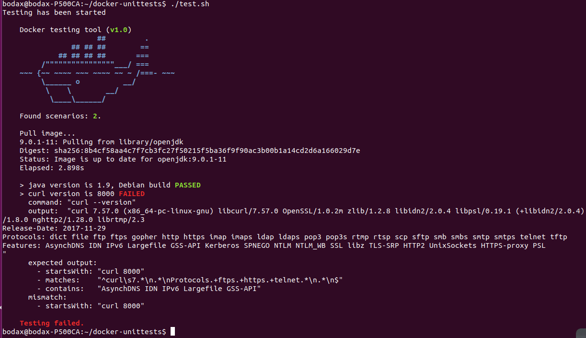

[](https://codebeat.co/projects/github-com-dgroup-docker-unittests-master)
[](https://travis-ci.org/dgroup/docker-unittests)[](http://www.0pdd.com/p?name=dgroup/docker-unittests)
[](https://codecov.io/gh/dgroup/docker-unittests)
[](https://www.versioneye.com/user/projects/5a26cbce0fb24f3480a39124)
[](./LICENSE.txt)

### Testing of docker images
The main concept is that all tests should use the image as is without any 'internal' 
go-related features.
We, like users, receive the image and we are going to check what we've got.

The project has been started in Java as POC, however, I'm thinking about porting to python which is more suitable lang for the Ansible-oriented stack. 
Kindly ask you to raise the issue in case of any suggestions regarding another ways\languages.

1. Define an [*.yml file](./.guides/image-tests.yml) with tests.
   ```yml
   version: 1
   
   tests:
     - test:
         assume: "java version is 1.9, Debian build"
         cmd:    "java -version"
         output:
           - contains: "openjdk version \"9.0.1\""
           - contains: "build 9.0.1+11-Debian-1"
   
     - test:
         assume: "curl version is 7.xxx"
         cmd:    "curl --version"
         output:
           - startsWith: "curl 7."
           - matches:    "^curl\\s7.*\\n.*\\nProtocols.+ftps.+https.+telnet.*\\n.*\\n$"
           - contains:   "AsynchDNS IDN IPv6 Largefile GSS-API"
   ```
2. Run tests for image 
   ```bash
    java -jar docker-unittests.jar -f image-tests.yml -i openjdk:9.0.1-11
   ``` 
   
3. Run tests from *.sh
   ```yaml
   version: 1
    
    tests:
    
      - test:
          assume: "java version is 1.9, Debian build"
          cmd:    "java -version"
          output:
            - contains: openjdk version "9.0.1"
            - contains: build 9.0.1+11-Debian
    
      - test:
          assume: "curl version is 8000"
          cmd:    "curl --version"
          output:
            - startsWith: "curl 8000"
            - matches:    "^curl\\s7.*\\n.*\\nProtocols.+ftps.+https.+telnet.*\\n.*\\n$"
            - contains:   "AsynchDNS IDN IPv6 Largefile GSS-API"

   ``` 
   ./test.sh
   ```bash
    #!/usr/bin/env bash
    set -e
    echo Testing has been started
    java -jar docker-unittests.jar -f test.yml -i docker/whalesay
    echo This line will not be executed.
    ```
    

### F.A.Q.
 - Supported output predicates are `startsWith`, `endsWith`, `contains`, `equals` and `matches`(regexp statement).
 - [Contributing guide](./.guides/contributing.md)  
 - [Github](./.guides/github.md)
 - [Docker](https://github.com/dgroup/docker-on-windows#docker-faq)                                       
                                    
### TODOs for release 1.0-alpha
 - @todo #14 Add http://i.jpeek.org badge after release to maven central
 - @todo #15 Add https://sonarcloud.io badge once project moved to public
 - @todo #17 Add http://www.javadoc.io badge after release to maven central